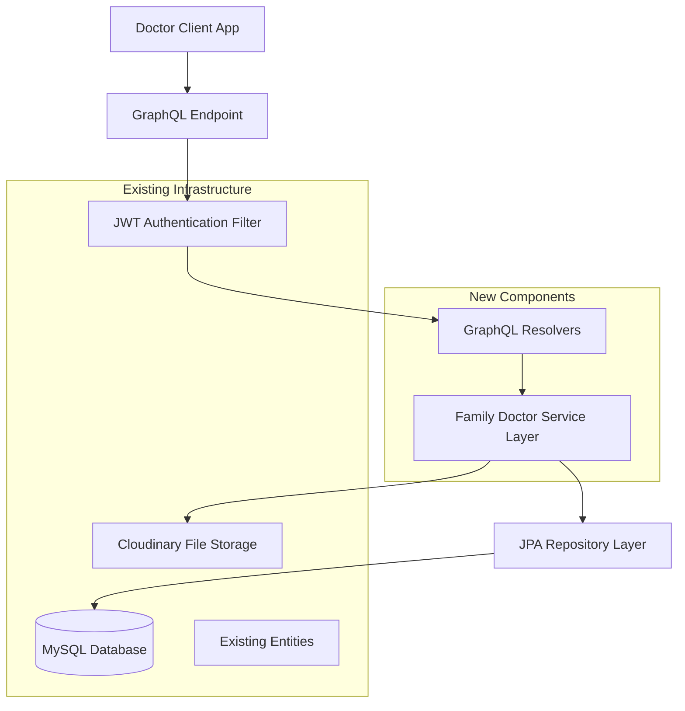

# Design Document - Family Doctor Medical Record Management

## Overview

The Family Doctor Medical Record Management system provides GraphQL API for family doctors to manage patient families, view medical records uploaded by patients, and handle connection requests. The system leverages existing entity models and integrates with the current Spring Boot application architecture using JWT authentication.

## Architecture

### High-Level Architecture



### Technology Stack Integration

- **Framework**: Spring Boot 3.5.6 (existing)
- **Security**: Spring Security + JWT (existing)
- **Database**: MySQL with JPA/Hibernate (existing)
- **File Storage**: Cloudinary (existing)
- **API**: GraphQL with Spring GraphQL (existing GraphQL support)
- **Entities**: Reuse existing User, Family, Member, MedicalRecord, DoctorAssignment, DoctorRequest

## Components and Interfaces

### Existing Entity Models (Reused)

#### User Entity (Doctor Role)
```java
// Existing User entity with UserRole.BacSi for doctors
@Entity
@Table(name = "users")
public class User implements UserDetails {
    @Id
    @GeneratedValue(strategy = GenerationType.IDENTITY)
    private Integer userID;
    
    private String fullName;
    private String email;
    private String passwordHash;
    private UserRole role; // BacSi for doctors
    private String phoneNumber;
    private String address;
    private String cccd;
    private String doctorCode; // Unique for doctors
    private LocalDateTime createdAt;
}
```

#### Family Entity
```java
// Existing Family entity
@Entity
@Table(name = "family")
public class Family {
    @Id
    @GeneratedValue(strategy = GenerationType.IDENTITY)
    private Integer familyID;
    
    private String familyName;
    private String address;
    
    @OneToOne
    @JoinColumn(name = "HeadOfFamilyID")
    private User headOfFamily; // ChuHo role
    
    private LocalDateTime createdAt;
}
```

#### Member Entity
```java
// Existing Member entity
@Entity
@Table(name = "members")
public class Member {
    @Id
    @GeneratedValue(strategy = GenerationType.IDENTITY)
    private Integer memberID;
    
    @ManyToOne(fetch = FetchType.LAZY)
    @JoinColumn(name = "FamilyID")
    private Family family;
    
    private String fullName;
    private LocalDate dateOfBirth;
    private Gender gender; // Nam, Nữ, Khác
    private String cccd;
    private String relationship;
    private String phoneNumber;
}
```

#### MedicalRecord Entity (Enhanced)
```java
// Existing MedicalRecord entity - may need enhancements
@Entity
@Table(name = "MedicalRecords")
public class MedicalRecord {
    @Id
    @GeneratedValue(strategy = GenerationType.IDENTITY)
    private Integer recordID;
    
    @ManyToOne
    @JoinColumn(name = "memberID")
    private Member member;
    
    private String symptoms;
    private String diagnosis;
    private String treatmentPlan;
    private LocalDateTime recordDate;
    private String fileLink; // Cloudinary URL for PDF
    
    // Additional fields may be needed:
    // private String originalFileName;
    // private String recordType;
    // private Long fileSize;
}
```

#### DoctorAssignment Entity
```java
// Existing DoctorAssignment entity for doctor-family relationships
@Entity
@Table(name = "DoctorAssignment")
public class DoctorAssignment {
    @Id
    @GeneratedValue(strategy = GenerationType.IDENTITY)
    private Integer assignmentID;
    
    @ManyToOne
    @JoinColumn(name = "doctorID")
    private User doctor; // UserRole.BacSi
    
    @ManyToOne
    @JoinColumn(name = "familyID")
    private Family family;
    
    private AssignmentStatus status; // ACTIVE, INACTIVE
}
```

#### DoctorRequest Entity
```java
// Existing DoctorRequest entity for connection requests
@Entity
@Table(name = "DoctorRequests")
public class DoctorRequest {
    @Id
    @GeneratedValue(strategy = GenerationType.IDENTITY)
    private Integer requestID;
    
    @ManyToOne
    @JoinColumn(name = "familyID")
    private Family family;
    
    @ManyToOne
    @JoinColumn(name = "doctorID")
    private User doctor;
    
    private String message;
    private RequestStatus status; // PENDING, ACCEPTED, REJECTED
    private LocalDateTime requestDate;
}
```

### New Entity for Doctor Notes

#### DoctorNote Entity (New)
```java
@Entity
@Table(name = "doctor_notes")
public class DoctorNote {
    @Id
    @GeneratedValue(strategy = GenerationType.IDENTITY)
    private Integer noteID;
    
    @ManyToOne(fetch = FetchType.LAZY)
    @JoinColumn(name = "recordID")
    private MedicalRecord medicalRecord;
    
    @ManyToOne(fetch = FetchType.LAZY)
    @JoinColumn(name = "doctorID")
    private User doctor; // UserRole.BacSi
    
    @Column(columnDefinition = "TEXT")
    private String noteContent;
    
    private LocalDateTime createdAt;
    private LocalDateTime updatedAt;
}
```

### Service Layer Architecture

#### Family Doctor Service
```java
@Service
@Transactional
public class FamilyDoctorService {
    
    // View patient families
    List<Family> getMyPatientFamilies(Integer doctorId);
    Family getFamilyDetails(Integer doctorId, Integer familyId);
    
    // Medical records
    List<MedicalRecord> getFamilyMedicalRecords(Integer doctorId, Integer familyId);
    MedicalRecord getMedicalRecordDetails(Integer doctorId, Integer recordId);
    byte[] downloadMedicalRecord(Integer doctorId, Integer recordId);
    
    // Connection requests
    List<DoctorRequest> getPendingConnectionRequests(Integer doctorId);
    DoctorRequest acceptConnectionRequest(Integer doctorId, Integer requestId);
    DoctorRequest rejectConnectionRequest(Integer doctorId, Integer requestId);
    
    // Doctor notes
    DoctorNote addDoctorNote(Integer doctorId, Integer recordId, String noteContent);
    DoctorNote updateDoctorNote(Integer doctorId, Integer noteId, String noteContent);
    void deleteDoctorNote(Integer doctorId, Integer noteId);
    
    // Search and filtering
    List<Family> searchFamilies(Integer doctorId, String searchTerm);
    List<MedicalRecord> filterMedicalRecords(Integer doctorId, String recordType, LocalDateTime fromDate, LocalDateTime toDate);
}
```

### GraphQL Schema and Resolvers

#### GraphQL Schema Definition
```graphql
type Query {
    # Family queries
    myPatientFamilies: [Family!]!
    familyDetails(familyId: Int!): Family
    
    # Medical record queries
    familyMedicalRecords(familyId: Int!): [MedicalRecord!]!
    medicalRecordDetails(recordId: Int!): MedicalRecord
    
    # Connection request queries
    pendingConnectionRequests: [DoctorRequest!]!
    
    # Search queries
    searchFamilies(searchTerm: String!): [Family!]!
    filterMedicalRecords(familyId: Int, recordType: String, fromDate: String, toDate: String): [MedicalRecord!]!
}

type Mutation {
    # Connection request mutations
    acceptConnectionRequest(requestId: Int!): DoctorRequest!
    rejectConnectionRequest(requestId: Int!): DoctorRequest!
    
    # Doctor note mutations
    addDoctorNote(recordId: Int!, noteContent: String!): DoctorNote!
    updateDoctorNote(noteId: Int!, noteContent: String!): DoctorNote!
    deleteDoctorNote(noteId: Int!): Boolean!
}

type Family {
    familyID: Int!
    familyName: String!
    address: String
    headOfFamily: User!
    members: [Member!]!
    medicalRecords: [MedicalRecord!]!
    createdAt: String!
}

type Member {
    memberID: Int!
    fullName: String!
    dateOfBirth: String
    gender: Gender!
    relationship: String
    phoneNumber: String
    medicalRecords: [MedicalRecord!]!
}

type MedicalRecord {
    recordID: Int!
    member: Member!
    symptoms: String
    diagnosis: String
    treatmentPlan: String
    recordDate: String!
    fileLink: String
    doctorNotes: [DoctorNote!]!
}

type DoctorNote {
    noteID: Int!
    noteContent: String!
    doctor: User!
    createdAt: String!
    updatedAt: String!
}

type DoctorRequest {
    requestID: Int!
    family: Family!
    doctor: User!
    message: String
    status: RequestStatus!
    requestDate: String!
}

enum Gender {
    Nam
    Nu
    Khac
}

enum RequestStatus {
    PENDING
    ACCEPTED
    REJECTED
}
```

#### GraphQL Resolvers
```java
@Component
public class FamilyDoctorResolver implements GraphQLQueryResolver, GraphQLMutationResolver {
    
    @Autowired
    private FamilyDoctorService familyDoctorService;
    
    // Query resolvers
    public List<Family> myPatientFamilies(DataFetchingEnvironment env) {
        Integer doctorId = getCurrentDoctorId(env);
        return familyDoctorService.getMyPatientFamilies(doctorId);
    }
    
    public Family familyDetails(Integer familyId, DataFetchingEnvironment env) {
        Integer doctorId = getCurrentDoctorId(env);
        return familyDoctorService.getFamilyDetails(doctorId, familyId);
    }
    
    public List<MedicalRecord> familyMedicalRecords(Integer familyId, DataFetchingEnvironment env) {
        Integer doctorId = getCurrentDoctorId(env);
        return familyDoctorService.getFamilyMedicalRecords(doctorId, familyId);
    }
    
    public List<DoctorRequest> pendingConnectionRequests(DataFetchingEnvironment env) {
        Integer doctorId = getCurrentDoctorId(env);
        return familyDoctorService.getPendingConnectionRequests(doctorId);
    }
    
    // Mutation resolvers
    public DoctorRequest acceptConnectionRequest(Integer requestId, DataFetchingEnvironment env) {
        Integer doctorId = getCurrentDoctorId(env);
        return familyDoctorService.acceptConnectionRequest(doctorId, requestId);
    }
    
    public DoctorNote addDoctorNote(Integer recordId, String noteContent, DataFetchingEnvironment env) {
        Integer doctorId = getCurrentDoctorId(env);
        return familyDoctorService.addDoctorNote(doctorId, recordId, noteContent);
    }
    
    private Integer getCurrentDoctorId(DataFetchingEnvironment env) {
        // Extract doctor ID from JWT token in GraphQL context
        return ((User) env.getContext()).getUserID();
    }
}
```

## Data Models

### Database Schema (Existing + New)

```sql
-- Existing tables (already implemented)

-- Users table (doctors have UserRole.BacSi)
CREATE TABLE users (
    UserID INT PRIMARY KEY AUTO_INCREMENT,
    FullName VARCHAR(100) NOT NULL,
    Email VARCHAR(100) UNIQUE NOT NULL,
    PasswordHash VARCHAR(255) NOT NULL,
    Role ENUM('ChuHo', 'BacSi', 'Admin') NOT NULL,
    PhoneNumber VARCHAR(20),
    Address VARCHAR(255),
    CCCD VARCHAR(20),
    DoctorCode VARCHAR(20), -- For doctors only
    GoogleID VARCHAR(255),
    FacebookID VARCHAR(255),
    IsProfileComplete BOOLEAN DEFAULT TRUE,
    CreatedAt TIMESTAMP DEFAULT CURRENT_TIMESTAMP
);

-- Family table
CREATE TABLE family (
    FamilyID INT PRIMARY KEY AUTO_INCREMENT,
    FamilyName VARCHAR(100) NOT NULL,
    Address VARCHAR(255),
    HeadOfFamilyID INT REFERENCES users(UserID),
    CreatedAt TIMESTAMP DEFAULT CURRENT_TIMESTAMP
);

-- Members table
CREATE TABLE members (
    MemberID INT PRIMARY KEY AUTO_INCREMENT,
    FamilyID INT REFERENCES family(FamilyID),
    FullName VARCHAR(100) NOT NULL,
    DateOfBirth DATE,
    Gender ENUM('Nam', 'Nữ', 'Khác'),
    CCCD VARCHAR(20),
    Relationship VARCHAR(50),
    PhoneNumber VARCHAR(20)
);

-- MedicalRecords table (may need enhancements)
CREATE TABLE MedicalRecords (
    recordID INT PRIMARY KEY AUTO_INCREMENT,
    memberID INT REFERENCES members(MemberID),
    symptoms TEXT,
    diagnosis TEXT,
    treatmentPlan TEXT,
    recordDate TIMESTAMP,
    fileLink VARCHAR(500) -- Cloudinary URL for PDF
    -- Additional fields may be added:
    -- originalFileName VARCHAR(255),
    -- recordType VARCHAR(50),
    -- fileSize BIGINT
);

-- DoctorAssignment table (existing)
CREATE TABLE DoctorAssignment (
    assignmentID INT PRIMARY KEY AUTO_INCREMENT,
    doctorID INT REFERENCES users(UserID),
    familyID INT REFERENCES family(FamilyID),
    status ENUM('ACTIVE', 'INACTIVE')
);

-- DoctorRequests table (existing)
CREATE TABLE DoctorRequests (
    requestID INT PRIMARY KEY AUTO_INCREMENT,
    familyID INT REFERENCES family(FamilyID),
    doctorID INT REFERENCES users(UserID),
    message TEXT,
    status ENUM('PENDING', 'ACCEPTED', 'REJECTED'),
    requestDate TIMESTAMP
);

-- New table for doctor notes
CREATE TABLE doctor_notes (
    noteID INT PRIMARY KEY AUTO_INCREMENT,
    recordID INT REFERENCES MedicalRecords(recordID) ON DELETE CASCADE,
    doctorID INT REFERENCES users(UserID) ON DELETE CASCADE,
    noteContent TEXT NOT NULL,
    createdAt TIMESTAMP DEFAULT CURRENT_TIMESTAMP,
    updatedAt TIMESTAMP DEFAULT CURRENT_TIMESTAMP ON UPDATE CURRENT_TIMESTAMP
);
```

### Repository Layer

#### Repository Interfaces
```java
@Repository
public interface FamilyRepository extends JpaRepository<Family, Integer> {
    @Query("SELECT f FROM Family f JOIN DoctorAssignment da ON f.familyID = da.family.familyID " +
           "WHERE da.doctor.userID = :doctorId AND da.status = 'ACTIVE'")
    List<Family> findByDoctorId(@Param("doctorId") Integer doctorId);
    
    @Query("SELECT f FROM Family f JOIN DoctorAssignment da ON f.familyID = da.family.familyID " +
           "WHERE da.doctor.userID = :doctorId AND da.status = 'ACTIVE' AND f.familyID = :familyId")
    Optional<Family> findByDoctorIdAndFamilyId(@Param("doctorId") Integer doctorId, @Param("familyId") Integer familyId);
    
    @Query("SELECT f FROM Family f JOIN DoctorAssignment da ON f.familyID = da.family.familyID " +
           "WHERE da.doctor.userID = :doctorId AND da.status = 'ACTIVE' " +
           "AND (f.familyName LIKE %:searchTerm% OR f.headOfFamily.fullName LIKE %:searchTerm%)")
    List<Family> searchByDoctorIdAndTerm(@Param("doctorId") Integer doctorId, @Param("searchTerm") String searchTerm);
}

@Repository
public interface MedicalRecordRepository extends JpaRepository<MedicalRecord, Integer> {
    @Query("SELECT mr FROM MedicalRecord mr JOIN mr.member m JOIN m.family f " +
           "JOIN DoctorAssignment da ON f.familyID = da.family.familyID " +
           "WHERE da.doctor.userID = :doctorId AND da.status = 'ACTIVE' AND f.familyID = :familyId")
    List<MedicalRecord> findByDoctorIdAndFamilyId(@Param("doctorId") Integer doctorId, @Param("familyId") Integer familyId);
    
    @Query("SELECT mr FROM MedicalRecord mr JOIN mr.member m JOIN m.family f " +
           "JOIN DoctorAssignment da ON f.familyID = da.family.familyID " +
           "WHERE da.doctor.userID = :doctorId AND da.status = 'ACTIVE' AND mr.recordID = :recordId")
    Optional<MedicalRecord> findByDoctorIdAndRecordId(@Param("doctorId") Integer doctorId, @Param("recordId") Integer recordId);
}

@Repository
public interface DoctorRequestRepository extends JpaRepository<DoctorRequest, Integer> {
    List<DoctorRequest> findByDoctorUserIDAndStatus(Integer doctorId, DoctorRequest.RequestStatus status);
    
    @Query("SELECT dr FROM DoctorRequest dr WHERE dr.doctor.userID = :doctorId AND dr.requestID = :requestId")
    Optional<DoctorRequest> findByDoctorIdAndRequestId(@Param("doctorId") Integer doctorId, @Param("requestId") Integer requestId);
}

@Repository
public interface DoctorNoteRepository extends JpaRepository<DoctorNote, Integer> {
    List<DoctorNote> findByMedicalRecordRecordIDOrderByCreatedAtDesc(Integer recordId);
    
    @Query("SELECT dn FROM DoctorNote dn WHERE dn.doctor.userID = :doctorId AND dn.noteID = :noteId")
    Optional<DoctorNote> findByDoctorIdAndNoteId(@Param("doctorId") Integer doctorId, @Param("noteId") Integer noteId);
}

@Repository
public interface DoctorAssignmentRepository extends JpaRepository<DoctorAssignment, Integer> {
    boolean existsByDoctorUserIDAndFamilyFamilyIDAndStatus(Integer doctorId, Integer familyId, DoctorAssignment.AssignmentStatus status);
}
```

## Error Handling

### Custom Exception Classes
```java
@ResponseStatus(HttpStatus.NOT_FOUND)
public class FamilyNotFoundException extends RuntimeException {
    public FamilyNotFoundException(String message) {
        super(message);
    }
}

@ResponseStatus(HttpStatus.FORBIDDEN)
public class UnauthorizedFamilyAccessException extends RuntimeException {
    public UnauthorizedFamilyAccessException(String message) {
        super(message);
    }
}

@ResponseStatus(HttpStatus.NOT_FOUND)
public class MedicalRecordNotFoundException extends RuntimeException {
    public MedicalRecordNotFoundException(String message) {
        super(message);
    }
}
```

### Global Exception Handler
```java
@RestControllerAdvice
public class FamilyDoctorExceptionHandler {
    
    @ExceptionHandler(FamilyNotFoundException.class)
    public ResponseEntity<ErrorResponse> handleFamilyNotFound(FamilyNotFoundException ex) {
        return ResponseEntity.status(HttpStatus.NOT_FOUND)
            .body(new ErrorResponse("FAMILY_NOT_FOUND", ex.getMessage()));
    }
    
    @ExceptionHandler(UnauthorizedFamilyAccessException.class)
    public ResponseEntity<ErrorResponse> handleUnauthorizedAccess(UnauthorizedFamilyAccessException ex) {
        return ResponseEntity.status(HttpStatus.FORBIDDEN)
            .body(new ErrorResponse("UNAUTHORIZED_ACCESS", ex.getMessage()));
    }
}
```

## Security Implementation

### Authorization Strategy
- **JWT Integration**: Leverage existing JWT authentication filter
- **Role-based Access**: Ensure user has DOCTOR role
- **Resource-level Authorization**: Verify doctor-family relationships before granting access
- **Audit Logging**: Log all access attempts and operations

### Security Service
```java
@Service
public class FamilyDoctorSecurityService {
    
    @Autowired
    private DoctorAssignmentRepository doctorAssignmentRepository;
    
    public boolean canAccessFamily(Integer doctorId, Integer familyId) {
        return doctorAssignmentRepository.existsByDoctorUserIDAndFamilyFamilyIDAndStatus(
            doctorId, familyId, DoctorAssignment.AssignmentStatus.ACTIVE);
    }
    
    public boolean canAccessMedicalRecord(Integer doctorId, Integer recordId) {
        // Check if doctor has access to the family that owns this medical record
        return medicalRecordRepository.findByDoctorIdAndRecordId(doctorId, recordId).isPresent();
    }
    
    public void logAccess(Integer doctorId, String resource, String action) {
        // Implement audit logging
        log.info("Doctor {} accessed {} with action {}", doctorId, resource, action);
    }
}
```

## Performance Optimization

### Caching Strategy
- **Query Caching**: Cache frequently accessed family lists and medical record metadata
- **File Caching**: Leverage Cloudinary CDN for PDF file delivery
- **Database Optimization**: Strategic indexing on foreign keys and search fields

### Database Indexes
```sql
-- Performance indexes for existing tables
CREATE INDEX idx_doctor_assignment_doctor_status ON DoctorAssignment(doctorID, status);
CREATE INDEX idx_doctor_assignment_family_status ON DoctorAssignment(familyID, status);
CREATE INDEX idx_medical_records_member_date ON MedicalRecords(memberID, recordDate);
CREATE INDEX idx_doctor_requests_doctor_status ON DoctorRequests(doctorID, status);
CREATE INDEX idx_doctor_notes_record_id ON doctor_notes(recordID);
CREATE INDEX idx_doctor_notes_doctor_id ON doctor_notes(doctorID);
CREATE INDEX idx_members_family_id ON members(FamilyID);
CREATE INDEX idx_users_role_doctor_code ON users(Role, DoctorCode);
```

## Integration Points

### File Storage Integration
- **Cloudinary**: Existing integration for PDF storage and delivery
- **Security**: Signed URLs for secure file access
- **Optimization**: Thumbnail generation for PDF previews

### Notification Integration
- **Email Notifications**: For connection request status updates
- **In-app Notifications**: Real-time updates for new requests
- **SMS Integration**: Optional SMS notifications for urgent updates

## Testing Strategy

### Unit Testing
- Service layer business logic testing
- Repository layer data access testing
- Security service authorization testing
- DTO mapping and validation testing

### Integration Testing
- REST API endpoint testing with MockMvc
- Database integration testing with @DataJpaTest
- Security integration testing with @WithMockUser
- File upload/download integration testing

### End-to-End Testing
- Complete workflow testing (connection request → acceptance → record access)
- Authentication and authorization flow testing
- File handling and security testing